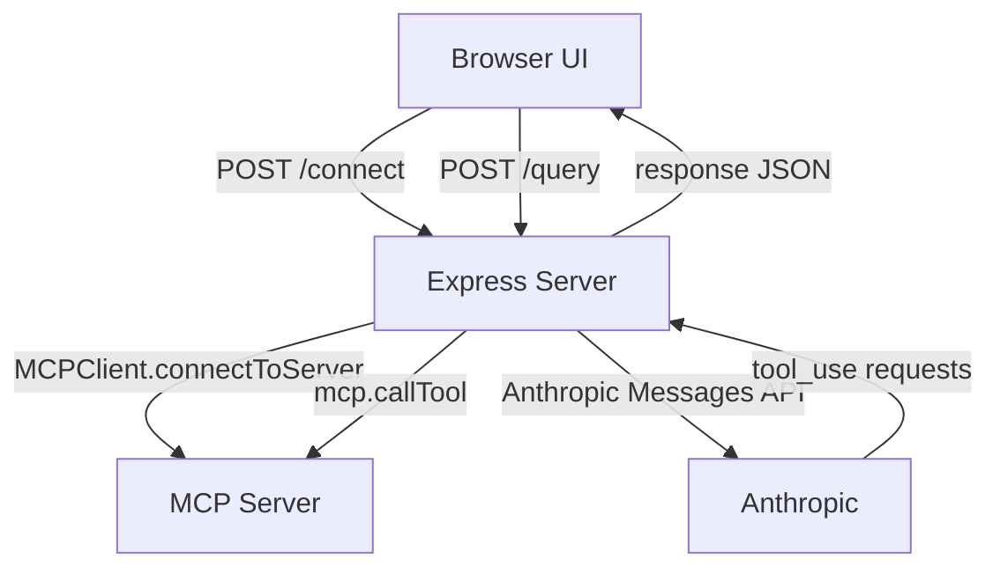

# MCP Client Server

An Express-based server and web UI for connecting to Model Context Protocol (MCP) servers and routing user queries through the Anthropic API. This branch exposes a browser interface backed by an HTTP API, while still sharing the same MCP client logic used by the CLI.

## Features

- Web UI served from `/` for interactive chat
- HTTP API endpoints for connecting and querying
- Supports MCP servers via HTTP/S or local stdio (`.js` / `.py`)
- Single shared MCP client instance across requests

## Application Flow



**Step-by-step flow**
1. User opens `http://localhost:3000/` and enters an MCP server URL or script path.
2. The UI calls `POST /connect`, which initializes `MCPClient` and connects to the target server.
3. The UI sends chat messages to `POST /query`.
4. The server sends the user message to Anthropic along with MCP tool metadata.
5. If Anthropic requests a tool call, the server executes it against the MCP server and continues the conversation.
6. The final response is returned to the browser.

## Prerequisites

- Node.js (v18+ recommended)
- npm
- An Anthropic API key

## Installation

```bash
npm ci
```

## Configuration

Create a `.env` file in the project root:

```bash
ANTHROPIC_API_KEY=your_api_key_here
```

## Build

Compile TypeScript to `build/`:

```bash
npm run build
```

## Run the Server

```bash
node build/server.js
```

Then open: `http://localhost:3000`

## Web UI Usage

1. Enter a target MCP server URL or local script path.
2. Click **Connect**.
3. Ask questions in the chat box.

## HTTP API

### `POST /connect`

Connects to an MCP server.

**Body**
```json
{ "target": "https://subwayinfo.nyc/mcp" }
```

You can also pass a local script path:
```json
{ "target": "./path/to/server.py" }
```

### `POST /query`

Sends a query to the connected MCP server via Anthropic.

**Body**
```json
{ "query": "What tools do you have?" }
```

**Response**
```json
{ "response": "..." }
```

## CLI (Optional)

The CLI is still available from the shared MCP client:

```bash
node build/index.js <server_url_or_script>
```

## Project Structure

```
.
├── index.html          # Web UI
├── src/
│   ├── index.ts        # MCPClient (Anthropic + MCP tooling)
│   └── server.ts       # Express server + API routes
├── package.json
└── tsconfig.json
```

## Notes

- Local stdio servers must be `.js` or `.py` files.
- HTTP connections try Streamable HTTP first, then fall back to HTTP+SSE.
- The included `npm test` script is a placeholder and exits with a non-zero code.
